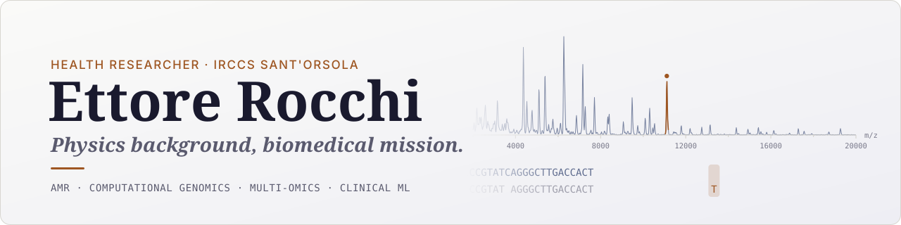

<picture>
  <source media="(prefers-color-scheme: dark)" srcset="assets/banner-dark.svg">
  
</picture>

<p align="center">
  <a href="https://ettorerocchi.github.io"></a>
  <a href="https://www.linkedin.com/in/ettore-rocchi/"></a>
  <a href="https://bsky.app/profile/ettorerocchi.bsky.social"></a>
  <a href="mailto:ettore.rocchi@aosp.bo.it"></a>
  <br>
  <a href="https://scholar.google.com/citations?user=MKHoGnQAAAAJ"></a>
  <a href="https://orcid.org/0000-0002-7612-2819"></a>
  <a href="https://www.scopus.com/authid/detail.uri?authorId=57220152522"></a>
</p>

I'm a Health Researcher at IRCCS Sant'Orsola in Bologna, where I develop computational methods to predict antimicrobial resistance, discover patient phenotypes, and make sense of high-dimensional omics data. My work spans MALDI-TOF mass spectrometry, multi-omics integration, genomics, and metagenomics, always with a focus on interpretability and clinical impact. I work in the Computational Genomics Unit, part of the Multi-Omics and Health-Care Data Analytics Unit at Sant'Orsola Hospital, and collaborate closely with Prof. Gastone Castellani's [Physics4MedicineLab](https://github.com/Physics4MedicineLab).

PhD in Health and Technologies (University of Bologna, 2026), supervisor Prof. Gastone Castellani.

---

### [MaldiSuite Ecosystem](https://github.com/EttoreRocchi/MaldiSuite)

<div align="center">
  <a href="https://github.com/EttoreRocchi/MaldiSuite">
    
  </a>
</div>

> **[MaldiSuite](https://github.com/EttoreRocchi/MaldiSuite)** - a Python ecosystem for MALDI-TOF spectral processing and analysis in antimicrobial resistance research. Visit the [MaldiSuite website](https://ettorerocchi.github.io/MaldiSuite/).

Three sklearn-compatible packages that chain into an end-to-end clinical AMR pipeline: preprocess with **MaldiAMRKit**, harmonise across batches/sites with **MaldiBatchKit**, classify with **MaldiDeepKit**.

```bash
pip install maldisuite   # MaldiAMRKit + MaldiBatchKit + MaldiDeepKit
```

<div align="center">
  <a href="https://github.com/EttoreRocchi/MaldiAMRKit">
    
  </a>
  <a href="https://github.com/EttoreRocchi/MaldiBatchKit">
    
  </a>
  <a href="https://github.com/EttoreRocchi/MaldiDeepKit">
    
  </a>
</div>

<p align="center">
  <a href="https://pypi.org/project/maldiamrkit/"></a>
  <a href="https://pypi.org/project/maldibatchkit/"></a>
  <a href="https://pypi.org/project/maldideepkit/"></a>
</p>

---

### Python Packages

| Package | Description | PyPI | Downloads |
|---------|-------------|------|-----------|
| [combatlearn](https://github.com/EttoreRocchi/combatlearn) | Scikit-learn compatible ComBat batch-effect correction | [](https://pypi.org/project/combatlearn/) |  |
| [ResPredAI](https://github.com/EttoreRocchi/ResPredAI) | AI model to predict resistances in Gram-negative bloodstream infections | [](https://pypi.org/project/respredai/) |  |
| [phenocluster](https://github.com/EttoreRocchi/phenocluster) | Unsupervised clinical phenotype discovery with survival and multistate modeling | [](https://pypi.org/project/phenocluster/) |  |
| [nestkit](https://github.com/EttoreRocchi/nestkit) | Nested cross-validation with calibration, threshold optimization, and statistical tests | [](https://pypi.org/project/nestkit/) |  |

### Research Code

| Project | Description |
|---------|-------------|
| [CATS](https://github.com/Physics4MedicineLab/CATS) | Automated Cas9 nuclease comparison with ClinVar integration |
| [CAMISIM-BrokenStick](https://github.com/Physics4MedicineLab/CAMISIM-BrokenStick) | Broken stick model extension for metagenomic simulation |
| [APOBECSeeker](https://github.com/Physics4MedicineLab/APOBECSeeker) | APOBEC-style mutation identification from multiple sequence alignment |

---

### Research Focus

- **AMR & clinical machine learning** - MALDI-TOF, supervised & generative learning, cross-site harmonisation · [MaldiSuite](https://github.com/EttoreRocchi/MaldiSuite), [ResPredAI](https://github.com/EttoreRocchi/ResPredAI)
- **Infectious risk & pathogen surveillance** - patient phenotyping, survival & multi-state models, metagenomic surveillance · [phenocluster](https://github.com/EttoreRocchi/phenocluster), [CAMISIM-BrokenStick](https://github.com/Physics4MedicineLab/CAMISIM-BrokenStick)
- **Computational genomics** - structural variants, somatic calling, long-read sequencing · [APOBECSeeker](https://github.com/Physics4MedicineLab/APOBECSeeker), [CATS](https://github.com/Physics4MedicineLab/CATS)
- **Computational methodologies** - open-source tools, reproducible pipelines · [combatlearn](https://github.com/EttoreRocchi/combatlearn), [nestkit](https://github.com/EttoreRocchi/nestkit), [MaldiBatchKit](https://github.com/EttoreRocchi/MaldiBatchKit)

The full picture is on the [research page](https://ettorerocchi.github.io/research.html) of my website.

### Tech Stack


---

### Selected Publication

Bonazzetti, C., Rocchi, E. *et al.* [Artificial Intelligence model to predict resistances in Gram-negative bloodstream infections](https://doi.org/10.1038/s41746-025-01696-x). *npj Digital Medicine* **8**, 319 (2025). Code: [ResPredAI](https://github.com/EttoreRocchi/ResPredAI).

A curated list with BibTeX lives on [my website](https://ettorerocchi.github.io/publications.html); for the complete record, see my [Google Scholar](https://scholar.google.com/citations?user=MKHoGnQAAAAJ) profile.
